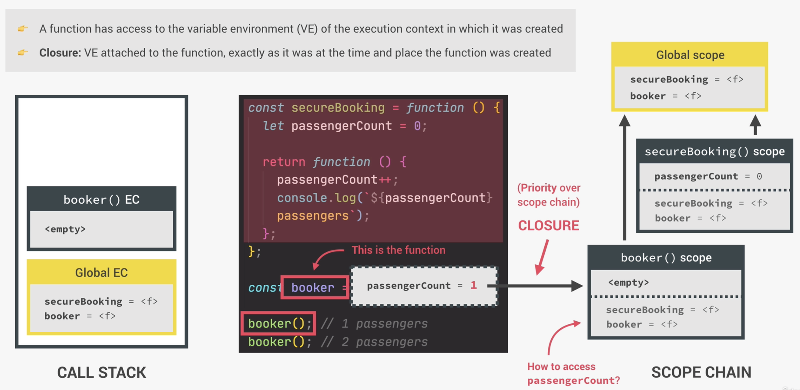

# Functions

## Default values in function

```js
const createBooking = function (flightNum, numPassengers = 1, price = 199 * numPassengers){...}

createBooking("Ldsd");
```

- Cannot skip parameter
  - But can do `createBooking('LL', undefined, 1000)`

## First-class vs Higher-order functions

### First-class functions (just a concept)

- JS treats functions as first-class citizens
  - Functions are simply values
- Functions are just another "type" of object
  

### Higher-order functions

- Function that receives another function as an argument, that returns a new function, or both
  - Benefit of a higher-order function: abstraction & reusability
- Only possible because of first-class functions


```js
const upperFirstWord = function (str) {
  const [first, ...others] = str.split(' ');
  return [first.toUpperCase(), ...others].join(' ');
};

// Higher-order function
const transformer = function (str, fn) {
  console.log(`Original string: ${str}`);
  console.log(`Transformed string: ${fn(str)}`);
  console.log(`Transformed by: ${fn.name}`); // Recall that functions have default properties too, e.g.: name here
};

transformer('Javascript is the best!', upperFirstWord);

// JS uses callbacks all the time
const high5 = function () {
  console.log('hi!');
};

document.body.addEventListener('click', high5);
['Jonas', 'Moml', 'Adam'].forEach(high5);
```

## `Call` and `Apply`

```js
const lufthansa = {
  airline: 'Lufthansa',
  iataCode: 'LH',
  bookings: [],
  // book: function(){} - This is conventional way of creating functions
  book(flightNum, name) {
    console.log(
      `${name} booked a seat on ${this.airline} flight ${this.iataCode}${flightNum}`
    );
    this.bookings.push({ flight: `${this.iataCode}${flightNum}`, name });
  },
};

// This will work where it is a method call, so `this` here refers to the object
lufthansa.book(293, 'Jonas');
lufthansa.book(635, 'John');
console.log(lufthansa);

// Need to have the same property names as lufthansa
const eurowings = {
  airline: 'Eurowings',
  iataCode: 'EW',
  bookings: [],
};

const book = lufthansa.book;

// This will not work because it is a function call, and `this` is undefined
// book(23, 'Sarah');
```

### `call()`

- Function `call()` used to set what `this` is referring to

```js
book.call(eurowings, 23, 'Sarah'); // `this` refers to eurowings
console.log(eurowings);

book.call(lufthansa, 29, 'Mary'); // `this` refers to lufthansa
console.log(lufthansa);
```

### `apply()`

- Same as `call()` but does not take parameters

```js
const swiss = {
  airline: 'Swiss Airline',
  iataCode = 'LX',
  bookings = [],
};

// `apply()` method
const flightData = [583, 'George Cooper'];
book.apply(swiss, flightData);
console.log(swiss);

// Can also achieve the same with `call()`. Modern JS uses this more than `apply()`
book.call(swiss, ...flightData);

```

### `bind()`

- Set `this`, but does not call the function unlike `call()`, will create a new function and return instead

```js
// `this` keyword set in stone here
const bookEW = book.bind(eurowings);
const bookEW = book.bind(lufthansa);

bookEW(23, ' Steven');
const bookEW23 = book.bind(eurowings, 23);
bookEW23('Jonas');

// With Event listener
lufthansa.plane = 300;
lufthansa.buyPlane = function () {
  this.plane++;
  console.log(this.planes);
};

// `this` keyword always point to the element calling the fuction
// In this case, it is the `buy` button
document.querySelector('.buy').addEventListener('click', lufthansa.buyPlane);

// However, we do not want the `this` keyword referring to the button, we want to
// refer to lufthansa. So in this case we use `bind()` as we do not want to call the function yet
document
  .querySelector('.buy')
  .addEventListener('click', lufthansa.buyPlane.bind(lufthansa)); // `this` will be lufthansa
```

### Partial application (preset variables)

```js
const addTax = (rate, value) => value + value * rate;
console.log(addTax(0.1, 200));

// Given a case where we have a fix tax e.g.: VAT
const addVAT = addTax.bind(null, 0.23); // here we set `this` to null, because also not even used in addTax(). We need to set in the correct order, e.g.: 2nd parameter is `rate`
//-- In this case, it will look like:
// addVAT = value => value + value * 0.23;

console.log(addVAT(1090));

// Challenge: Using Function returning Function method
const addTax = function (rate) {
  return function (value) {
    return value + value * rate;
  };
};

const addVA2 = addTax(0.23);
console.log(addVAT(1090));
```

## Immediately Invoked Function Expressions (IIFE)

- `IIFE`: Execute function immediately, and not save it anywhere, i.e. to only run function once
- Its more a pattenr

```js
const runOnce = function () {
  console.log('Will never run again');
};

runOnce(); // this is not IIFE, because we can still keep invoking runOnce()

// IIFE
(function () {
  // have () wrapped is to create a function expression. Otherwise, JS will need a variable name to house the function, so () is to "trick"
  console.log('function will only run once');
})(); // using () at the end is to invoke the function

// IIFE: Arrow-function
(() => console.log('This will also not run again'))();
```

# Closures

- Not a feature explicitly used, it happens automatically, just need to recognise those situations
  
  
- IMPORTANT: a function has access to the variable environment (VE) of the execution context in which it was created (even if the execution context was already removed from the call stack)
  - In the image, it is the `secureBooking()` VE that was removed
- Thanks to closures, a function does not lose connection to variables that existed at the function's birthplace

## Summary


- Using `console.dir(xx)` to see the closures
  

## Examples

```js
let f;

const g = function () {
  const a = 23; // a is inside the backpack of f function
  f = function () {
    console.log(a * 2);
  };
};

const h = function () {
  const b = 777;
  f = function () {
    console.log(b * 2);
  };
};

g();
f(); // g already executed but f() can still access a
console.dir(f);

// Reassigning f() through h()
// We see that closures still working as is, i.e. does not lose connection with its parent
h();
f();
console.dir(f);
```
