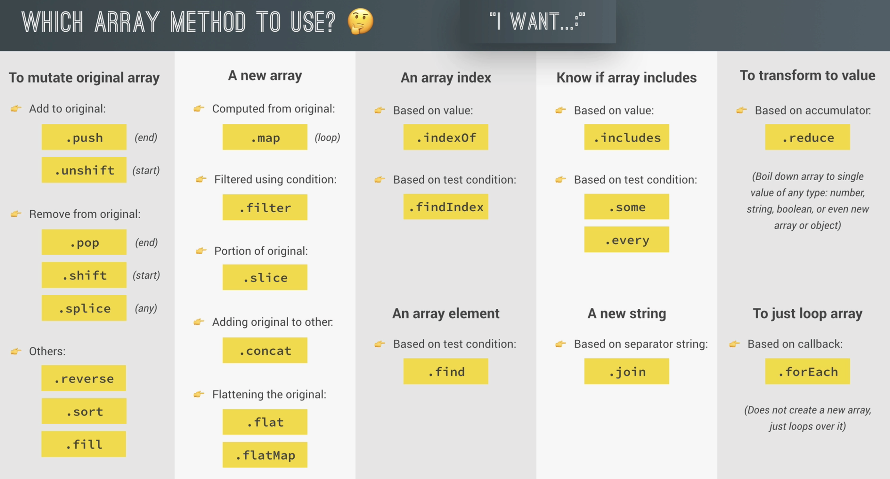

# Introduction

## Commonly used array functions

### `slice`

- Returns a copy

```js
let arr = ['a', 'b', 'c', 'd', 'e'];
console.log(arr.slice(2)); //  ['c', 'd', 'e']
console.log(arr.slice(-2)); // ['d', 'e']
console.log(arr.slice(1, -2)); // ['b', 'c']
console.log(arr.slice()); // shallow copy, same as [...arr]
```

### `splice`

- Mutates array

```js
let arr = ['a', 'b', 'c', 'd', 'e'];
arr.slice(-1);
console.log(arr); // ['a', 'b', 'c', 'd'];

arr.slice(1, 2);
console.log(arr); // ['a', 'd']
```

### `reverse`

- Mutates array

```js
let arr = ['a', 'b', 'c', 'd', 'e'];
console.log(arr.reverse()); // ['e', 'd', 'c', 'b', 'a']
console.log(arr); // ['e', 'd', 'c', 'b', 'a']
```

### `concat`

```js
const letters = arr.concat(arr2);
```

### `join`

```js
console.log(letters.join('-'));
```

### `at`

```js
let arr = ['a', 'b', 'c', 'd', 'e'];
console.log(arr.at(0)); // 'a'
```

## `ForEach` vs `For of`

```js
const movements = [1010, -434, 2312, -53, 22, 2314];

//-- For Each
for (const movement of movements) {
  // if want indexes - use this instead:
  //=> for (const [i, movement] of movements.entries())
  console.log(movement);
}

//-- For Each
// Use callback function in high-order function
movements.forEach(function (movement) {
  // if want indexes - use this instead (order must be retained: element, index, whole array)
  //=> movements.foreach(function (mov, i, arr))
  console.log(movement);
});
// Basically is just iterating array movements:
// 0: function(1010)
// 1: function(-434)
// 2...
```

- `ForEach` vs `For of`
  - `ForEach` cannot have `return` or `break` unlike `For of`

### `ForEach` in `Map` and `Sets`

```js
const currencies = new Map([
  ['USD', 'United States dollar'],
  ['EUR', 'Euro'],
  ['GBP', 'Pound sterling'],
]);

// Map
currencies.forEach(function(value, key, map)){ // NOTE the order as well

}

// Set
const currenciesUnique = new Set(['USD', 'GBP', 'USD', 'EUR', 'EUR']);
console.log(currenciesUnique);
// NOTE: here actually key (2nd element) = value because in Set, there's no index and its not a map also
// But API is designed this way for consistency
currenciesUnique.forEach(function(value, _value, map)){
    console.log(`${value}: ${_value}`);
}
```

## Data Transformations with: `Map, Filter, and Reduce`

### `Map`

- Takes in a callback function
- Returns a new array containing the results of applying an operation on all orgiinal array elements
  - Unlike `forEach`, `Map` returns a new array

```js
const eurToUsd = 1.1;

// const movementsUSD = movements.map(function (mov) {
//   // Put each value as an element in a new array
//   return mov * eurToUsd;
// });

// Cleaner way but debatable on readability
const movementsUSD = movements.map(mov => mov * eurToUsd);

// movements array not mutated
console.log(movements);
console.log(movementsUSD);
```

### `Filter`

- Returns a new array containing the array elements that passed a condition

```js
// return boolean in filter()
const deposits = movements.filter(function (mov) {
  return mov > 0;
});
```

### `Reduce`

- Boils("reduce") all array elements down to 1 single value (e.g.: adding all elements together)
  - Applying an aggregator

```js
// reduce callback function is a bit different
// 1st element: accumulator (diff from the rest like forEach)
// 2nd element: current
// 3rd element: index
// 4th element: array

// reduce() takes 2 parameters: callback function & the initial number
const balance = movements.reduce(function (acc, cur, i, arr) {
  // acc will be the previous sums
  return acc + cur;
}, 0);
```

## Chaining in arrays

```js
const eurToUsd = 1.1;

const totalDepositsUSD = movements
  .filter(mov => mov > 0)
  .map(mov => mov * eurToUsd)
  .reduce((acc, mov) => acc + mov, 0);
```

- Chaining can cause big performance overhead for large arrays
  - Need to try to see how to compress
- It is a bad practice to mutate in pipeline of chaining

## `find()`

- Similar to others, takes a callback function
- Unlike `filter()`, `find()` only returns the first element in the array that meets the condition
  - `filter()` returns a new array, `find()` only return the element

```js
movements.find(mov => mov < 0);

// Where `accounts` have the same field `owner`
const accounts = accounts.find(acc => acc.owner === 'Jessica');
```

## `findIndex()`

```js
const index = accounts.findIndex(
  acc => acc.username === currentAccount.username
);
console.log(index);
```

- Can do much more than just `.indexOf()` which only returns if the array contains this value while `findIndex()` can take in a function

## `some()`, `every()`

- If there is any that matches the condition, then `some()` will return `true`

```js
// Only checks for equality
console.log(movements.includes(-130));

// Can specify condition
const anyDeposits = movements.some(mov => mov > 5000);
console.log(anyDeposits);

// Every
console.log(movements.every(mov => mov > 0));
```

## `flat()`, `flatMap()`

```js
const arr = [[1, 2, 3], [4, 5, 6], 7, 8];
console.log(arr.flat()); // [1,2,3,4,5,6,7,8]

const arrDeep = [[[1, 2], 3], [4, [5, 6]], 7, 8];
console.log(arrDeep.flat()); // not able to flatten nested arrays
// [[1, 2], 3, 4, [5, 6], 7, 8]

// Need to use: flat(2)
console.log(arrDeep.flat(2));

// FlatMap - flatten the result INSTEAD of using flat() + map()
const overalBalance2 = accounts
  .flatMap(acc => acc.movements)
  .reduce((acc, mov) => acc + mov, 0);
```

- FlatMap only goes 1 level deep, if need more than 1 level, can only use `flat()`

## `Sort()`

```js
// Ascending
movements.sort((a, b) => {
  if (a > b) return 1;
  if (a < b) return -1;
});

// Descending
movements.sort((a, b) => {
  if (a > b) return -1;
  if (a < b) return 1;
});
```

## Creation of arrays

```js
// Method 1
const a = new Array(1, 3, 4);

// Method 2
const x = new Array(7);
x.fill(1, 3, 5);

// Method 3
const arr = [1, 2, 3, 4];

// Method 4
//// Array.from ----> use array constructor
Array.from({ length: 7 }, () => 1); //[1, 1, 1, 1, 1, 1, 1]
```

- The array constructor takes in callback function

```js
const movementsUI = Array.from(
  document.querySelectorAll('.movements__value'),
  el => Number(el.textContent.replace('EUR', ''))
);
```

# Summary


