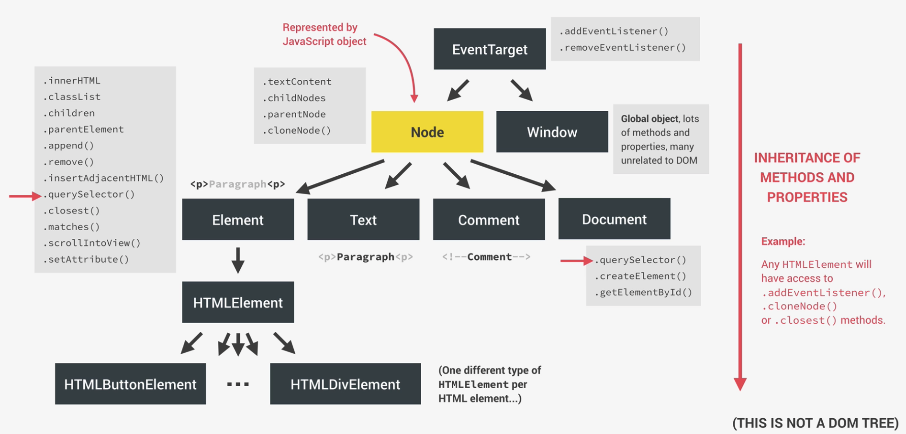
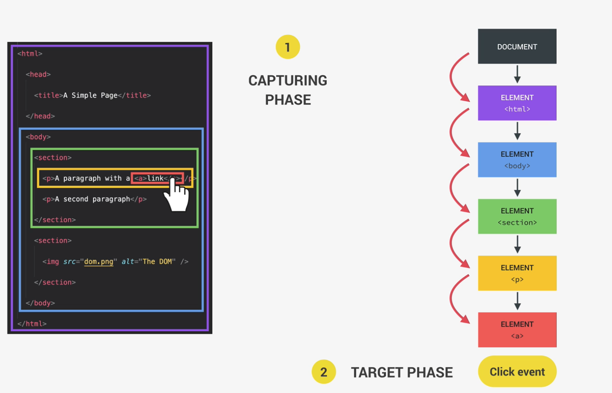
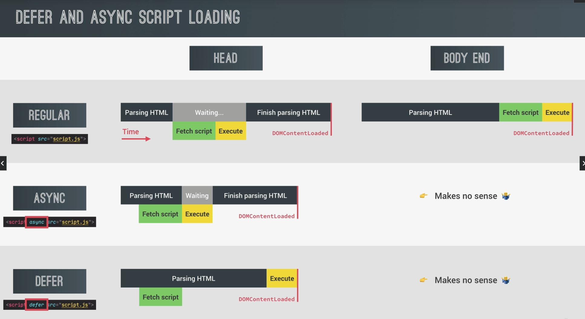
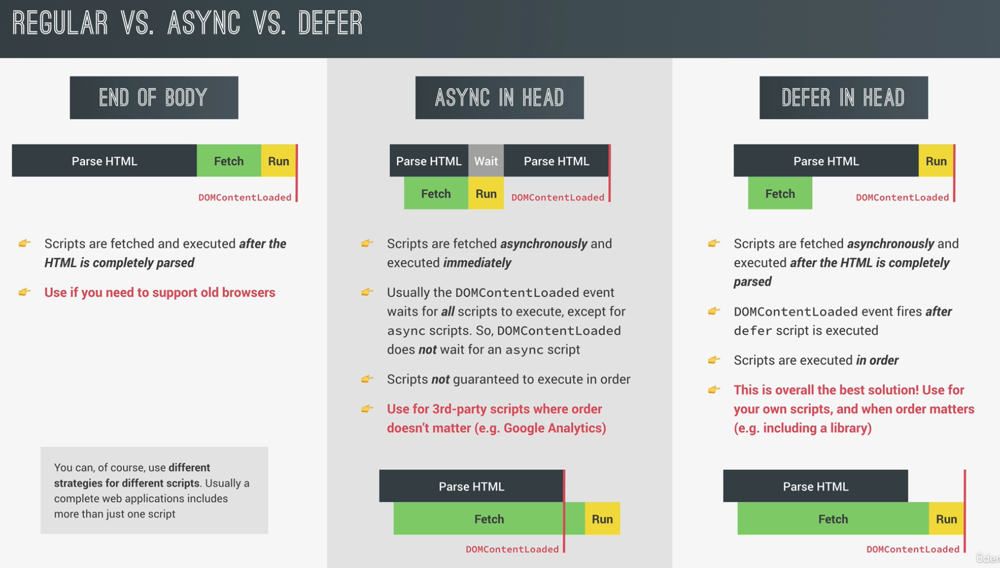

# Advanced DOM

## How DOM API is organized behind the scenes



## Smooth scrolling

- `getBoundingClientRect();`

```js
const btnScrollTo = document.querySelector('.btn--scroll-to');
const section1 = document.querySelector('#section--1');

btnScrollTo.addEventListener('click', function (e) {
  const s1coords = section1.getBoundingClientRect();
  console.log(s1coords); // this is the object that contains the coordinates of the element

  console.log('Current scroll (X/Y)', window.pageXOffset, pageYOffset);

  //-- M1. Old school way of scrolling
  window.scrollTo(s1coords.left, s1coords.top); // this s1coords.top is always relative to the viewpoint, NOT the top of the document

  // This will mean we are adding the offset to allow the elment reach the top of the document (page)
  window.scrollTo(
    left: s1coords.left + window.pageXOffset,
    top: s1coords.top + window.pageYOffset,
    behaviour: 'smooth'
  );

  //-- M2. Current way supported in browsers scrolling
  section1.scrollIntoView({behavior: 'smooth'})
});
```

## Event bubbling & Event capturing

- The event actually happens at the document root and from there, it travels down to the target element
  - The target element is `e.target` while the current element that is handling the event is `e.currentTarget`)
- Bubbling up means basically it's as if the event also happened in all of its parent elements
  
- Can use `e.stopPropagation()` to stop this propagation
- Event capturing is the opposite of bubbling up

```js
document.querySelector('.nav').addEventListener(
  'click',
  function (e) {
    this.style.backgroundColor = randomColor();
    console.log('NAV', e.target, e.currentTarget);
  },
  true // Set to true means to skip event bubbling, but only event capturing
);
```

- But now, rarely do event capturing as event bubbling is useful - for event delegation

### Event delegation

- To help in a more efficient implementation
- E.g.: Instead of creating the same event listeners to each of the element in the same navigation bar to have the same behaviour (esp if there are a lot of elements), we can just simply create an event listener to the parent and make use of event bubbling up
- E.g.: Page navigation

```js
// M1: 1 event listener per element in .nav__link
document.querySelectorAll('.nav__link').forEach(function (el) {
  el.addEventListener('click', function (e) {
    e.preventDefault();
    const id = this.getAttribute('href');
    console.log(id);
    document.querySelector(id).scrollIntoView({ behavior: 'smooth' });
  });
});

// M2: Using event delegation (more efficient)
// 1. Add event listener to common parent element
// 2. Determine what element originated the event
document.querySelector('.nav__links').addEventListener('click', function (e) {
  console.log(e.target); // useful to check if we need matching strategy as we may not be interested in all elements in the parent element

  e.preventDefault();

  // Matching strategy
  if (e.target.classList.contains('nav__link')) {
    // What we are interested in
    console.log('LINK');

    const id = e.target.getAttribute('href');
    document.querySelector(id).scrollIntoView({ behavior: 'smooth' });
  }
});
```

- More useful in cases where we want to add event listeners to elements that may not have existed (e.g.: dynamic)

## DOM traversing

- `querySelector()` finds children while `closest()` finds parents

```js
const h1 = document.querySelector('h1');

// Going downwards: child
console.log(h1.querySelectorAll('.highlight'));
console.log(h1.childNodes);
console.log(h1.children);
h1.firstElementChild.style.color = 'white';
h1.lastElementChild.style.color = 'orangered';

// Going upwards: parents
console.log(h1.parentNode);
console.log(h1.parentElement);

// Selects the closest header to our h1 element
h1.closest('.header').style.background = 'var (--gradient-secondary)'; // CSS variable (custom properties)
h1.closest('h1').style.background = 'var(--gradient-primary)';

// Going sideways: siblings
console.log(h1.previousElementSibling);
console.log(h1.nextElementSibling);

console.log(h1.previousSibling);
console.log(h1.nextSibling);

// All siblings including itself (i.e. 'h1' element)
console.log(h1.parentElement.children);
```

- `closest()` would be very useful for event delegation

  - E.g.:

  ```js
  tabsContainer.addEventListener('click', function (e) {
    // if we simply do this, the clicked constant may be a wrong element (eg.: we clicked the number & the content itself in a button)
    const clicked = e.target.parent;
    // HENCE, we use `closest()` to find the parent element that is a button here instead
    const clicked = e.target.closest('.operations__tab');

    console.log(clicked);
  });
  ```

## Intersection Observer API

- Example: To implement sticky navigation, For revealing elements when scrolling (fades in), lazy loading images
- Requirements
  - Create a new `IntersectionObserver`
- Use observer to observe a certain target

```js
// Use Case 1: Sticky navigation
const obsCallback = function () {};

const obsOption = {
  root: null, // Root element is the element that we want our target element to intersect
  threshold: 0.1, // Percentage of intersection at which the observer callback will be called
  rootMargin: '-90px', // Box of 90 pixels that will be applied outside of the target element
};

const observer = new IntersectionObserver(obsCallback, obsOptions);
observer.observe(section1); // Here is the target

// Use case 2: Reveal sections
const allSections = document.querySelectorAll('.section');

const revealSection = function (entries, observer) {
  const [entry] = entries;

  if (!entry.isIntersecting) return;

  entry.target.classList.remove('section--hidden');
  observer.unobserve(entry.target);
};

const sectionObserver = new IntersectionObserver(revealSection, {
  root: null,
  threshold: 0.15,
});

allSections.forEach(function (section) {
  sectionObserver.observe(section);
  section.classList.add('section--hidden');
});

// Use Case 3: Lazy loading images
const imgTargets = document.querySelectorAll('img[data-src]');

const loadImg = function (entries, observer) {
  const [entry] = entries;

  if (!entry.isIntersecting) return;

  // Replace src with data-src
  entry.target.src = entry.target.dataset.src;

  entry.target.addEventListener('load', function () {
    entry.target.classList.remove('lazy-img');
  });

  observer.unobserve(entry.target);
};

const imgObserver = new IntersectionObserver(loadImg, {
  root: null,
  threshold: 0,
  rootMargin: '200px',
});

imgTargets.forEach(img => imgObserver.observe(img));
```

- Set `root: null` if we want to observe our target element intersecting the entire viewpoint
- Tip: Can adjust the `Network tab` to use `Slow 3G` if we need to observe the transition

## Lifecycle DOM events

- When we have our `<script/>` tag in our HTML file, it means that javascript will only be executed once the DOM elements have finished loaded
  - Hence, we don't need to explicitly have an event listener that waits for the DOM content to be loaded before we do anything else:

```js
document.addEventListener('DOMContentLoaded', function (e) {
  console.log('HTML parsed and DOM tree built!', e);
});

window.addEventListener('load', function (e) {
  console.log('Page fully loaded', e);
});

// Can be useful, but can be too much
window.addEventListener('beforeunload', function (e) {
  e.preventDefault();
  console.log(e);
});
```

## Defer and Async script loading

- Hence, we put `script` at the body end for regular, so there's no wasted "Waiting"
- From the length, we see more efficient




- Can use the "Network" tab -> "DOMContentLoaded:xx s" -> "Stalled" time
