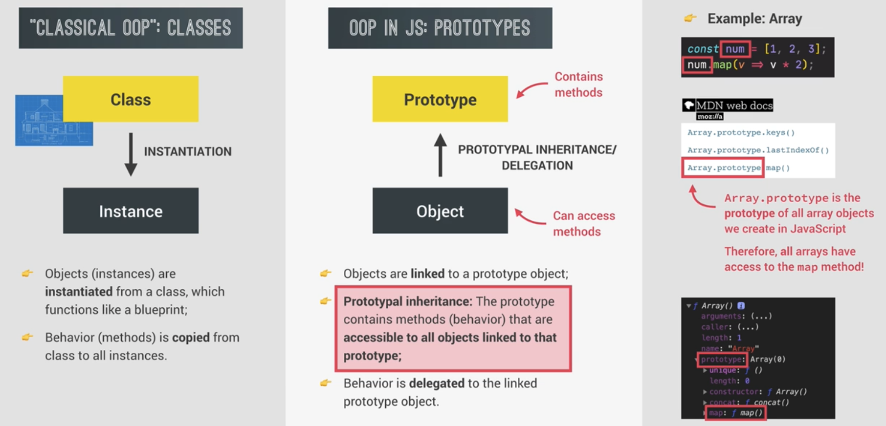
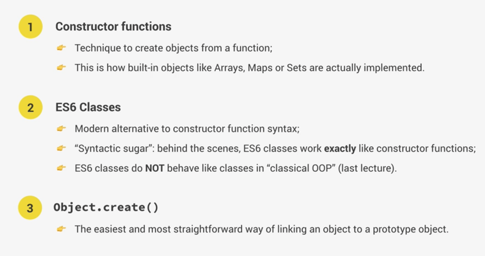
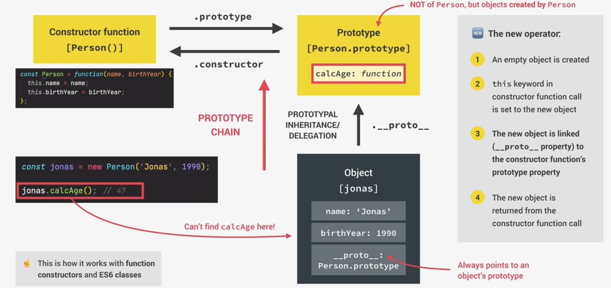
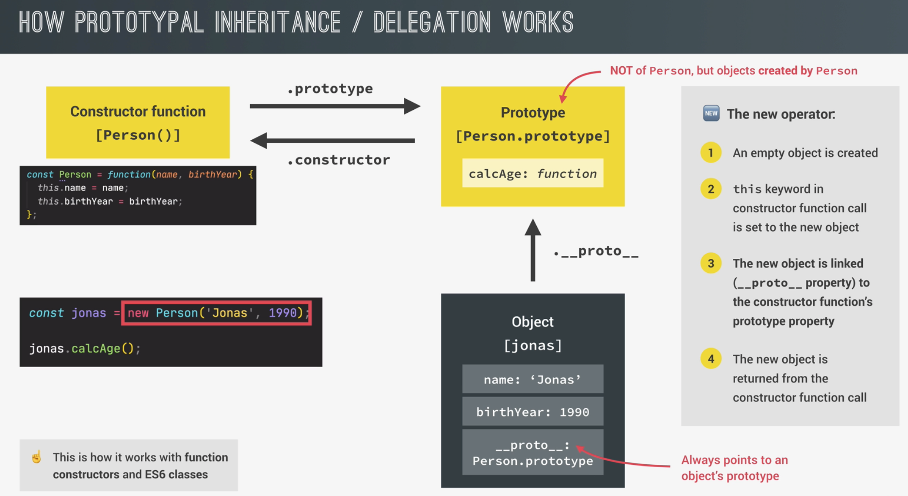
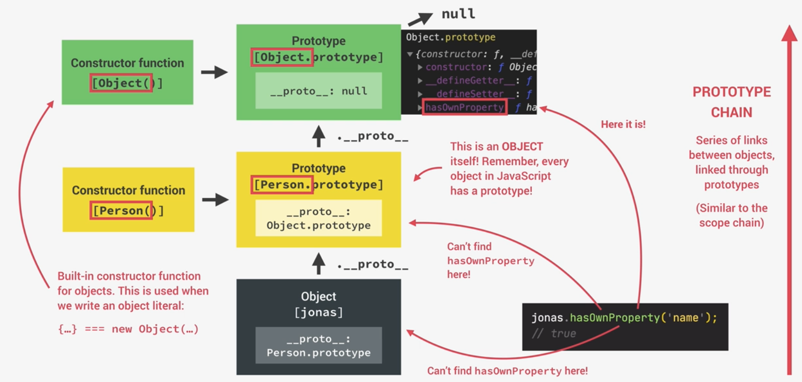
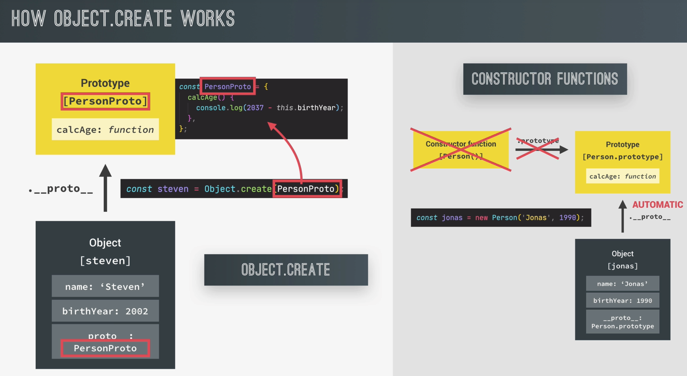
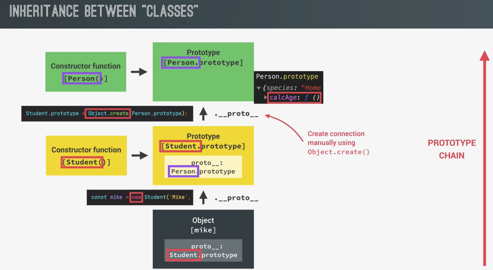
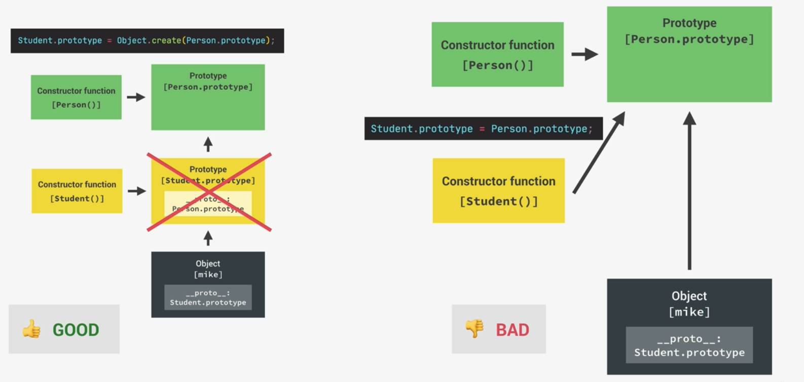
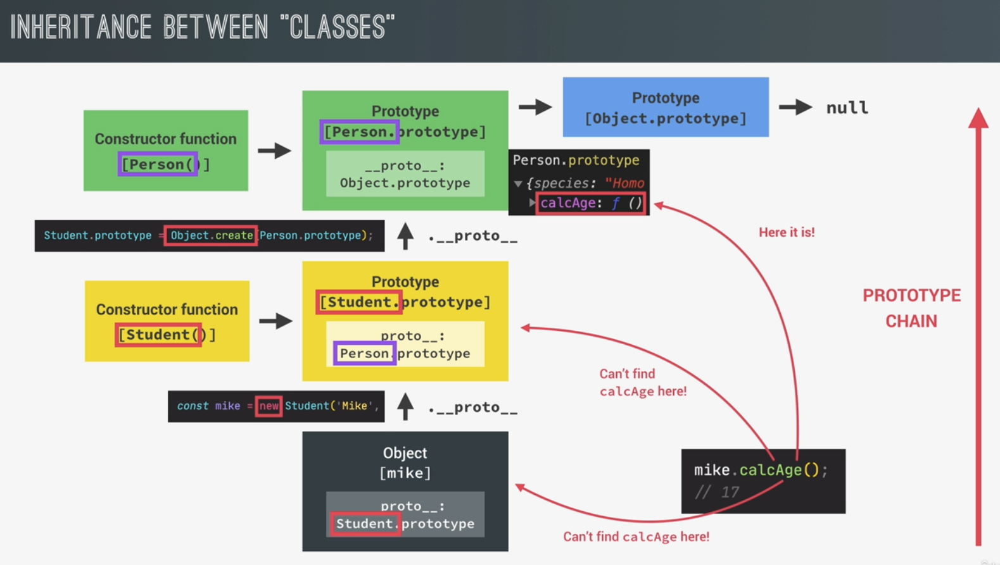
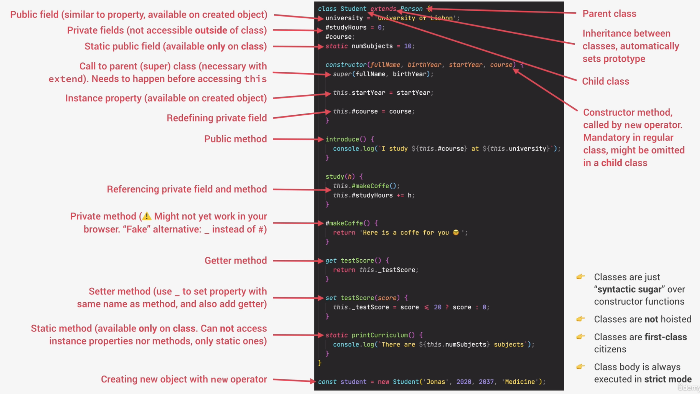

# Introduction

- JS does not support real classes

## OOP principles

1. Abstraction
2. Encapsulation
3. Inheritance
4. Polymorphism

## OOP in JS: Prototypes

- This is inheritance of instance to class
  - E.g.: `Map` in `Array`
    

## How to implement OOP in JS




## Prototypes

- Each every function has a property called `prototype`
  - Including constructor functions
- Prototype inheritance:
  - Even though the object itself does not have the function (e.g.: `calcAge()`), the object can use this function `calcAge()`
  - JS tries to find the method in the object first, if cannot find, will look into the Prototype

```js
const jonas = new Person('Jonas', 1991);
console.log(jonas); // can see that this object itself does not have calcAge();

// Prototypes
// Preferred to do this declaration of function, than declaring `calcAge()` without the Person class which means all the objects have this function
Person.prototype.calcAge = function () {
  // this calcAge() function only exists once in JS engine
  console.log(2037 - this.birthYear);
};

jonas.calcAge(); // will be able to trigger the `calcAge()` function because of prototype inheritance
```

- Prototype for inheritance is a mechanism for reusing code
- Prototype of the object is actually the prototype of the constructor function

```js
console.log(jonas.__proto__); // All objects have this property, __proto__
console.log(jonas.__proto__ === Person.prototype);
console.log(Person.prototype.isPrototypeOf(jonas));
```

### Prototype Inheritance / Delegation works



### Prototype Chain

- Prototype chain very similar to the scope chain
  
- `Object.prototype` is the top of prototype chain

## Es6 Classes

- ES6 classes allow us to do exact same thing, but using a nicer and modern syntax
  - Classes in JS do not work like traditional classes in languages like Java / C++
  - Instead, JS are just syntactic sugar over prototypes
    - They still implement prototypical inheritance behind the scenes, but with syntax that makes more sense to people
- Class expressions is just like functions

```js
// Class expression
// const PersonCl = class {}

// Class declaration
class PersonCl {
  // Constructor method - works the same as constructor functions
  constructor(firstName, birthYear) {
    this.firstName = firstName;
    this.birthYear = birthYear;
  }

  // These methods that we create within Class itself, will be on the prototype of objects, not on the objects itself
  calcAge() {
    console.log(2037 - this.birthYear);
  }
}

const jessica = new PersonCl('Jessica', 1996);
jessica.calcAge();

console.log(jessica.__proto__ === PersonCl.prototype);
```

- Things to note:
  - Classes are NOT hoisted
    - Cannot use them before they are being declared
  - Classes are first-class citizens (like functions)
    - Can pass them to functions and return them like functions
  - Classes are executed in strict mode
- Personal preference to use either `Classes` or `Constructor functions`

## Setter and Getter

```js
const account = {
  owner: 'Jonas',
  movements: [200, 530, 120, 300],

  get latest(){
    return this.movements.slice(-1).pop();
  },

  set latest(mov){
    this.movements.push(mov);
  }

  // Just like a function
  console.log(account.latest);

  // Just like a normal declaration
  account.latest = 50;
  console.log(account.movements);
}
```

## Static methods

- Examples:
  - `Array.from(...)`: Only available on `Array` constructor itself
    - Not `[1,2,3].from()`
- To create static methods:

```js
class PersonCl {
  ...

  // Instance method
  calcAge(){
    ..
  }

  // Static method
  static hey(){
    console.log("Hei");
  }
}
PersonCl.hey();
```

## `Object.create()`

- There are actually 3 ways to implement prototypical inheritance or delegation:
  - Constructor function
  - ESX classes
  - And `Object.create()`

```js
const PersonProto = {
  calcAge() {
    console.log(2037 - this.birthYear);
  },
};

const steven = Object.create(PersonProto);
console.log(steven); // see __proto__ , and calcAge() function
```



- This is quite least used

## Class inheritance

### M1: Constructor function

```js
const Person = function (firstName, birthYear) {
  this.firstName = firstName;
  this.birthYear = birthYear;
};
// Recall that in a regular function call, `this` is undefined
const Student = function (firstName, birthYear, course) {
  // Here, we are making a regular function call
  // And not doing something like `new Person(...)`
  Person(firstName, birthYear);
  // Hence, we need to pass the `this` keyword to Person(..)
  Person.call(this, firstName, birthYear);
  this.course = course;
};
```

- The link between instance and prototype was made automatically by creating the object with the `new` operator
  
  
  

```js
// Linking prototypes
Student.prototype = Object.create(Person.prototype); // This will result the Student constructor to be Person constructor (i.e. if we do `console.log(mike.__proto__);` We will see that the prototype is Person instead of Student)

Student.prototype.introduce = function (){
  ...
};

const mike = new Student('Mike', 2020, 'Computer Science');
console.log(mike.__proto__);
console.log(mike.__proto__.__proto__);

console.log(mike instanceof Student); // true
console.log(mike instanceof Person); // true

Student.prototype.constructor = Student; // we should do this so that mike.__proto__ will have prototype = Student
console.dir(Student.prototype.constructor); // use `dir` to see the constructor details
```

- Because of polymorphism, if there are 2 functions of the same argument & name (parent & child), JS will use the child's function (because of the prototype chain)

### M2: Inheritance between ES6 classes

```js
class StudentCl extends PersonCl {
  // This will link  prototypes
  constructor(fullName, birthYear, course) {
    // Always happens first!
    super(fullName, birthYear); // we don't need to do PersonCl.call(...)
    this.course = course;
  }
}
```

### M3: Inheritance using `Object.create()`

```js
const StudentProto = Object.create(PersonProto);
StudentProto.init = function (firstName, birthYear, course){
  PersonProto.init.call(this, firstName, birthYear);
  this.course = course;
}

StudentProto.introduce = function(){
  ...
}

// jay inherits Student Proto inherits PersonProto
const jay = Object.create(StudentProto);
jay.init('Jay', 2020, 'Computer Science');
jay.introduce();
jay.calcAge();
```

## Encapsulation: Private class fields and methods

```js
class Account {
  // 1) public fields (instances)
  locale = navigator.language;

  // 2) private fields (annotated with #)
  #movements = [];
  #pin;

  // 3) public methods
  // Public interface
  getMovements() {
    return this.#movements;
  }

  // 4) private methods
  #approveLoan() {}
}
```

- We use `_<property name>` as a convention to indicate protected access
  - e.g.: `_coffee = 3;`
  - Not implemented on language level, but is a convention for protected

# Summary


