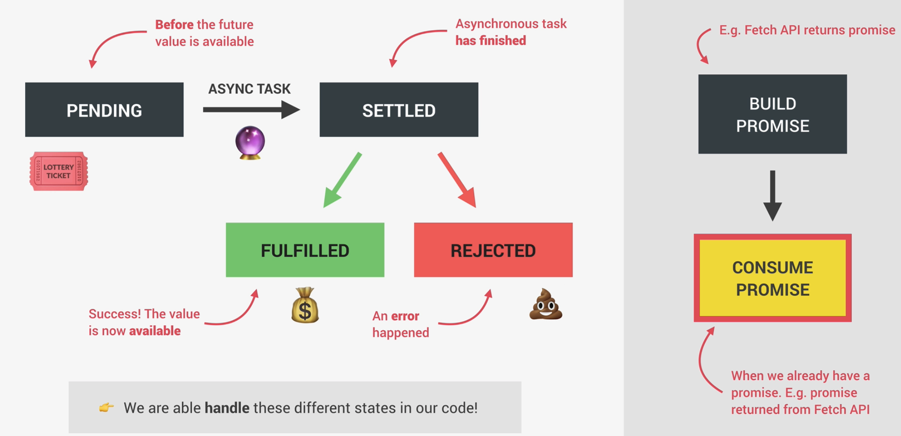
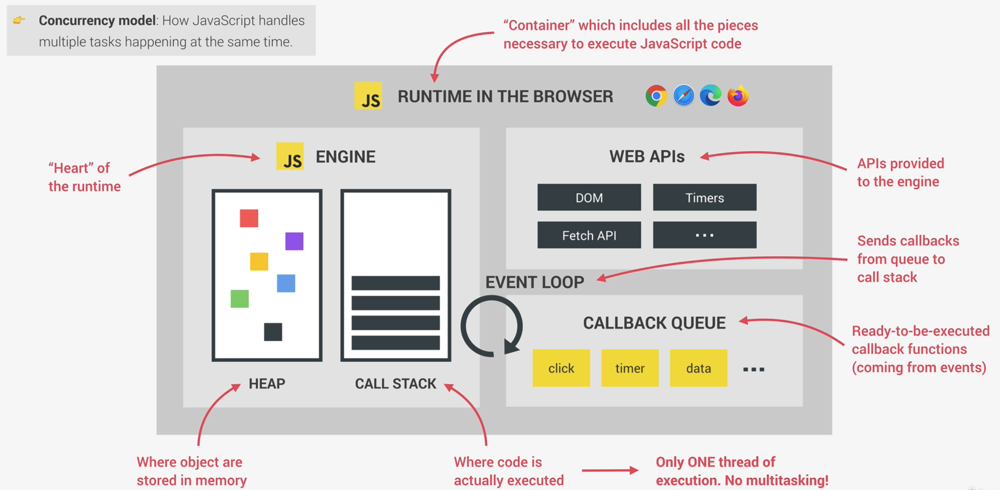
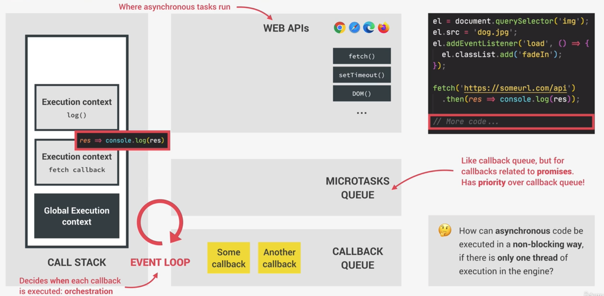
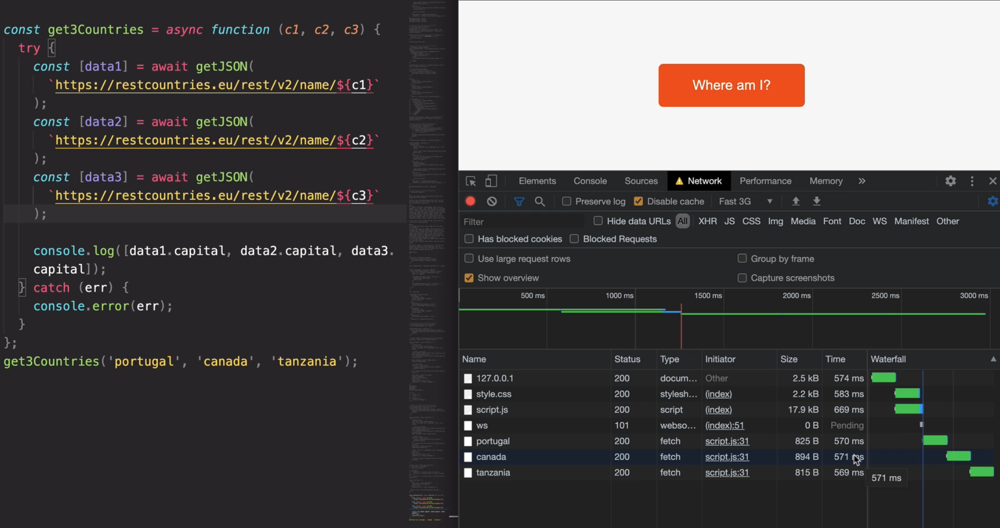

                                                                                                          # Introduction

- Synchronous code
  - Each line of code waits for prev line to finish
  - Long-running operations block code execution
- Asynchronous code
  - Executed after a task that runs in the "background" finishes
    - Execution does not wait for an asynchronous task to finish its work
  - Non-blocking
    - Callback functions alone does not make code asynchronous
      - e.g.: `setTimeout()` is asynchronous, but `addEventListener(..)` does not automatically make code asynchronous

## Ajax calls

- `Asynchronous Javascript And XML`: allows us to communicate with remote web servers in asynchronous way
  - With AJAX calls, we can request data from web servers dynamically

## Promises

- `Promise`: object that is used as a placeholder for future result of an async operations
  - Container for an asynchronously delivered value
  - Container for a future value
    - e.g.: `Response` from AJAX call
- No longer need to rely on events / callbacks passed into asynchronous functions to handle asynchronous results
- Instead of nesting callbacks, we can chain promises for a sequence of asynchronous operations: escaping callback hell
- Always handle returned values from Promises outside, i.e. don't result in `callback hell` - chaining promises within the promise itself

### Lifecycle



### Example

```js
const getCountryData = function (country) {
  fetch(`https://restcountries.eu/rest/v2/name/${country}`)
    .then(function (response) {
      // fetch() returns a Promise, so need to `then()`
      console.log(response);
      return response.json();
    })
    // this `data` here is the fulfilled value from the `response.json` Promise
    .then(function (data) {
      //response.json() itself returns a Promise, hence we need to `then()` again
      console.log(data);
    });
};
getCountryData('portugal');
```

### Handling errors

- Can handle errors globally no matter where the error appear in the Promise chain

```js
const getCountryData = function (country) {
    ...
}.then()
. then()
.catch(err => alert (err)); // catch here globally instead of in each `then()`
.finally(() => {..}) // Optional to add this, if we want to close
```

- `finally()` can only work if `catch()` itself returns Promises which is so

- Manually throw errors
  - Sometimes we may need to manually throw errors in cases where the function still did not reject the request
  ```js
  fetch(...)
    .then(response => {
        if(!response.ok)
          throw new Error(`Country not found ${response.status}`);
        return response.json();
    })
    ...
    .catch(err => alert(err)); // the error we thrown above will then be caught here
  ```

## The Event Loop

- Unlike other languages, JS is a single thread of execution
  - i.e. no multitasking
    
- Asynchronous tasks ran in Web APIs environment, and NOT call stack which is bad

- Once the load event has finished (e.g.: `el.src = 'dog.jpg`), the callback for this event is put into the callback queue
- Callback queue: ordered list of all the callback functions that are in line to be executed
  - Tasks that the call stack will eventually have to complete
  - This is very bad, because image we have a timer callback (e.g.: 5s timer), but if there are other callbacks to be done before this timer, the duration of the timer is then not guaranteed
    - **HENCE, cannot do high precision things using JS timers**
- Callback queue also contains callbacks coming from DOM events like clicks or key presses
- Hence, that is where the event loop comes in
  - It looks into the call stack and determines whether it is empty or not (except for the global context)
  - If the stack is indeed empty (i.e. no code is being executed), then it will take the first callback from the callback queue and put it on the call stack to be executed
  - So the event loop is basically who decides exactly when each callback is executed
  - Event loop does the orchestration of the entire JS runtime
- **Web APIs environment, callback queue, event loop make tit all possible that asynchronous code can be executed in a non-blocking way with only 1 thread of execution in the engine**



**Callbacks related to promises**

- Callbacks related to promises (e.g.: `fetch(..).then()`) do NOT go into the callback queue
  - Instead, they have a special queue - microtasks queue
- Microtasks queue has priority over the callback queue
  - So after at the end of an event loop ticker, after a callback has been taken from the callback queue, the event loop will check if there are any callbacks in the microtasks queue
- There could be a possibility be a case that the callback queue can never execute because of more and more microtasks - but usually never a problem

```js
console.log('Test');

// Creates a timer that is 0 second
setTimeout(() => console.log('0 sec timer'), 0);

// Create a promise that resolves immediately
Promise.resolve('Resolved promise').then(res => console.log('res'));
console.log('Test end');
```

- Here, the top level (i.e. synchronous) codes will run first then followed by the promise then the timer
  - Recall: Microtasks will be prioritized
    - So even though `timer` and `Promise.resolve(..)` end at the same time, the callback from `Promise.resolve()` will be handled first

## Building of Promise

```js
const lotteryPromise = new Promise(function (resolve, reject) {
  console.log('Lottery draw is happening');

  // simulate an asynchronous Promise through the use of timeout
  setTimeout(function () {
    if (Math.random() >= 0.5) {
      resolve('You win');
    } else {
      reject(new Error('You lost your money'));
    }
  }, 2000);
});

// Consume the promise
//-- the `res` here will be whatever we put in `resolve(..)` and `err` in `reject(..)`
lotteryPromise.then(res => console.log(res)).catch(err => console.log(error));
```

- We can also just reject a Promise immediately

```js
// Don't need to do .then() since reject() straightaway
Promise.reject(new Error('problem')).catch(x => console.log(x));
```

- In actual scenarios, we usually only consume `Promises`
  - Usually only build promises to wrap old callback-based functions into `Promises`
    - This process is called `Promisifying`

**Promisifying**

- Convert callback-based asynchronous behaviour to promise-based

```js
// Promisifying setTimeout()
const wait = function (secs) {
  // here we don't need to specify `reject` parameter, because almost impossible for timers to fail
  return new Promise(function (resolve) {
    // no resolved value is needed since not mandatory. And in the case of timer
    // is not necessary; we just want to simulate the code to wait
    setTimeout(resolve, secs * 1000);
  });
};

wait(2)
  .then(() => {
    console.log('waited for 2 seconds');
    return wait(1);
  })
  // have to do this again like a sequential Ajax call, because wait() returns a promise
  .then(() => console.log('I waited for 1 second'));
```

## Consuming promises with `async await`

- `async await` is just a syntatic sugar
- Before `async await`

```js
fetch(`https://restcountries.eu/rest/v2/name/${country}`).then(res =>
  console.log(res)
);
```

```js
const whereAmI = async function (country) {
  // Geolocation
  const pos = await getPosition();
  const { latitude: lat, longitude: lng } = pos.coords;

  // Reverse geocding
  const resGeo = await fetch(`https://geocode.xyz/${lat}, ${lng}?geoit=json`);
  const dataGeo = await resGeo.json();
  console.log(dataGeo);

  // Country data
  const res = await fetch(`https://restcountries.eu/rest/v2/name/${country}`);
  const data = await res.json();
  console.log(data);
};

whereAmI('portugal');
console.log('FIRST');
```

## Exception handling with `try..`

```js
const whereAmI = async function (country) {
  // Country data
  try {
    const res = await fetch(`https://restcountries.eu/rest/v2/name/${country}`);
    if (!res.ok) throw new Error('Problem getting country');
    const data = await res.json();
    console.log(data);
  } catch (err) {
    console.log(`${err} occured`);
  }
};
```

## Returning values from `async` functions

- `async` will always return a `Promise` and not values

```js
const whereAmI = async function (country) {
  // Country data
  try {
    const res = await fetch(`https://restcountries.eu/rest/v2/name/${country}`);
    const data = await res.json();
    return `You are in ${data.Geo.city}`;
  } catch (err) {
    console.error(`${err}`);

    // We will need to throw error to reject the promise returned from the async function
    throw err;
  }
};

// If we just do this, we will not reach the catch() because the Promise is still fulfilled, hence only the then() will be done
whereAmI()
  .then(city => console.log(`2: ${city}`))
  .catch(err => console.error(`2: ${err.message}`))
  .finally(() => console.log('done'));
```

- This will work, but we are mixing the old and new way of working with promises

  - Prefer to always use async functions instead of mixing them

- It will be great if we could use `await` without the `async` function but that does not really work for now as `await` can only be used inside an `async function`

  - HENCE, since we don't want to create a new function, we can use immediately invoked function expressions (IIFE)

- Converted:

```js
// Treat whereAmI() as any other Promises, so can just convert to async/await
(async function()){
  try{
    const city = await whereAmI();
    console.log(`2:${city}`);
  }
  catch (err){
    console.error(`2: ${err.message}`);
  }

  console.log('3: finished');
}
```

- List of `Promises`

```js
const imgs = imgArr.map(async img => await createImage(img)); // List of Promises
const imgsEl = await Promise.all(imgs); // List of images
```

## Running Promises in parallel

- Instead of running Promises in sequential:
  

```js
const get3Countries = function(){

  // 1 rejected promise is enough to reject the whole thing
  try {
    const data = await Promise.all([getJson(`https://restcountries.eu/rest/v2/name/${c1}`), getJson(`https://restcountries.eu/rest/v2/name/${c2}`), getJson(`https://restcountries.eu/rest/v2/name/${c3}`,)]);
    console.log(data.map(d => d[0].capital));
  }
  catch (err){
    console.error(err);
  }
});
```

- If there are multiple async operations at the same time and operations do not depend on one another, can use `Promise.all()`
- `Promise.all()` is one of the combinators

## Other `Promise` combinators

### `Promise.race`

- Return whatever data that returns first
  - To prevent a `Promise` that takes too long, we can also include `timeout`

```js
const timeout = function (sec) {
  return new Promise(function (_, reject) {
    setTimeout(function () {
      reject(new Error('Requst too long'));
    }, sec * 1000);
  });
};

Promise.race([
  getJson(`https://restcountries.eu/rest/v2/name/tanzania`),
  timeout(5),
])
  .then(res => console.log(res[0]))
  .catch(err => console.error(err));
```

### `Promise.allSettled`

- Will not short circuit like `Promise.all()`

```js
Promise.allSettled([Promise.resolve('Success'), Promise.reject('Error')]).then(
  res => console.log(res)).catch(err => console.error(err));
);
```

### `Promise.any` [ES2021]

- `Promise.any` very similar to `Promise.all`, but `Promise.any` will skip all those rejected ones

```js
Promise.any([Promise.resolve('Success'), Promise.reject('Error')]).then(
  res => console.log(res)).catch(err => console.error(err));
);
```
