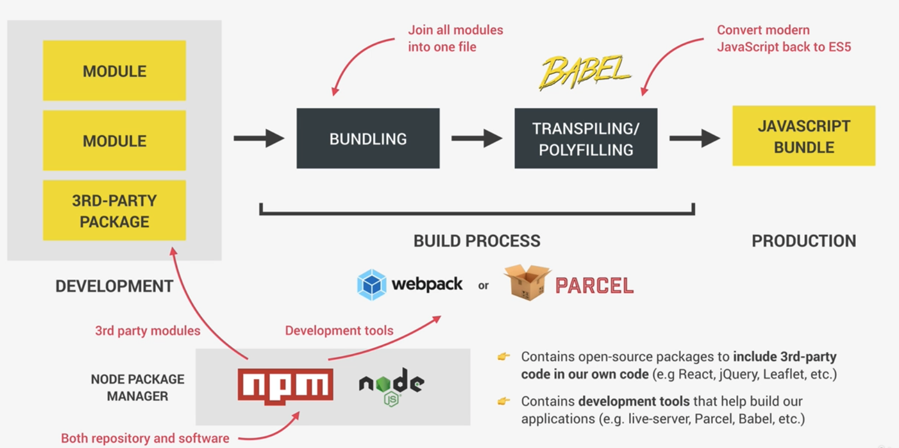
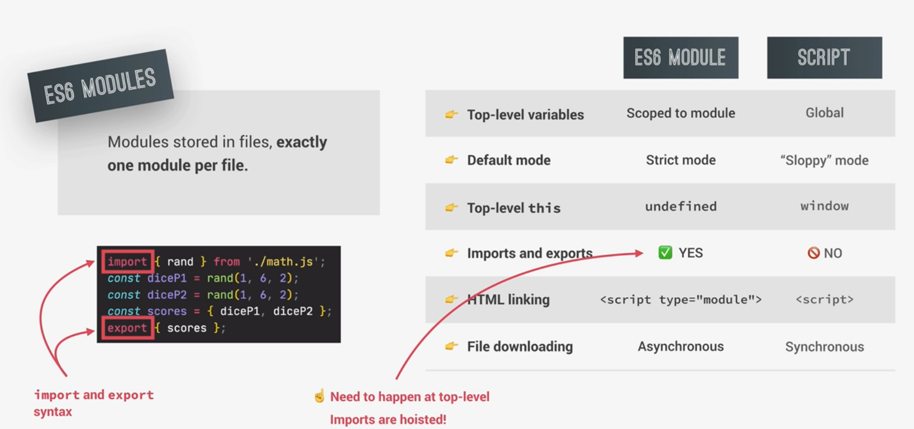
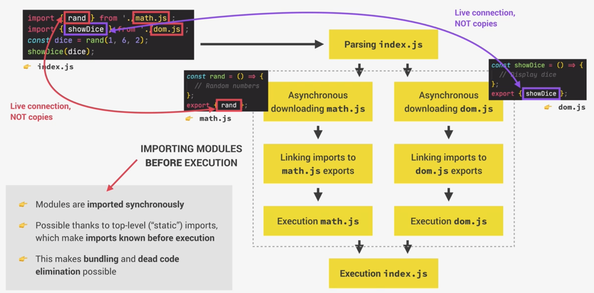

# JS Development



## Node Package Manager (`npm`)

- Modules (Packages) are shared on the `npm` repository
- `npm` software to download, use and share packages
- `npm i xx` vs `npm i xx -g`
  - `-g`: To install globally, so as to use in every directory without the intermediate step of an NPM script
  - locally: Recommended so that we can always stay on the latest version
- `--save-dev` (or `-D`)

  - To install a package as a development dependency
    - i.e. the package is essential for development tasks like compilation, testing, linting, and other build processes, but not directly required for the final production code that runs in your application

- Resources:
  - [npm install](https://docs.npmjs.com/cli/v7/commands/npm-install#:%7E:text=is%20not%20valid.-,npm%20install%20%3Calias%3E%40npm%3A%3Cname%3E,-%3A)

## Step 1 Build Process: Bundling

- Quite a complex process which can eliminate unused code and compress/code
- Important because:
  - Older browsers don't support modules at all
    - Hence code that is in a module cannot be executed by any older browser
    - More performant (less files to browser)
  - Beneficial that bundling step compresses code

## Step 2 Build Process: Transpiling / Polyfilling

- Convert all modern JS syntax and features back to old ES5 syntax, so even older browsers can understand the codes without breaking
- Usually done by `Babel`

## Build Process

- Populate Js bundlers: `webpack`, `Parcel`
- Js bundlers: transform raw code to JS bundle

# Modules

- Module: reusuable piece of code that encapsulates implemention details
- Different from just function/class
  - Module is usually a standalone file
- Benefits:
  - Compose software
  - Isolate components
  - Abstract code
  - Organized code
  - Reuse code

## Native JS (ES6) Modules

- Js has a native built-in module system
- ES6 modules are stored in files, exactly 1 module per file

### ES6 modules VS Old school scripts



- All imported modules are hoisted
  - They will be executed first

**How ES6 modules are imported**


- `parsing`: Read the code without executing it
- Imports are not copies of export, they are live connection
  - i.e. point to the same place
- Should not mix named and default exports in the same module
  - `export default ...`: can just name it anything

## Top-level `await`

- From ES2022 version, can use `await` outside of `async` functions, at least in modules
  - Called `top-level await`
- This only works in modules
- BEFORE (to use `await`):

```js
async function x(){
    ...
}

const res = await x();
```

- AFTER:

```js
const res = await fetch('...');
const data = await res.json();
```

- BUT this top-level `await` blocks the execution of the entire module
  - Esp those long running tasks

## CommonJS modules

- There are different module systems (e.g.: ES6 Modules, CommonJS modules)

```js
// Export
export.addToCart = function (product, quality) {
    ...
}

// Import
const {addToCart} = require('./shoppingCart.js')

```

## Bundling with `Parcel` and `Npm` scripts

### `parcel`

- Creates `dist` folder
  - e.g.: in `index.html`: `<script defer="" src="/index.3ec6c1be.js"></script>`
- `package.json`

```json
{
  "dependencies": {
    "parcel": "^2.11.0"
  }
}
```

- What
  - Uses default port of `1234`, and acts like the live-server
  - Bundle the imported modules (own modules, 3rd party modules)
  - Automatically uses `babel` to transpile / code
- Importing modules:
  - BEFORE (without `parcel`):
  ```js
  import cloneDeep from './node_modules/lodash-es/cloneDeep.js';
  ```
  - NOW:
  ```js
  import cloneDeep from 'lodash-es'; // OR import cloneDeep from 'lodash';
  ```
- Methods to use `parcel`:

  - Execute `npx parcel index.html` directly
  - (In practice) Include in `npm scripts` - `package.json`:

  ```json
    {
        ...,
        "scripts": {
            "start": "parcel index.html",
            "build": "parcel build index.html" // to build (+compress) final product
        }
    }
  ```

## `Babel`

- What
  - Compiler (`source code ==> output code`)
- Important because even after the new ES6 standard has been introduced, there are still many people who are stuck with old versions of Windows (e.g.: Window XP) which cannot upgrade old internet explorers
  - Hence, we use tools like `Babel to tranpile modern code back to ES5 code for codes to still be used on old IE
- We can configure `Babel` a lot if we want to define exactly what browsers should be supported, but that will be a lot of work
  - `Parcel` however make very good default decisions for us which we usually just go with the default
- `Babel` works with plugins and presets that can be both configured
  - Plugin is a specific JS feature that we want to transpile
- `Babel` used to do polyfilling out of the box, but recently they started to recommend another library
  - HENCE, now we need to manually import that, i.e. `core-js`

### Polyfill

- `Polyfill`: piece of code used to provide modern functionality on older browsers that do not natively support it

  - The reason why polyfills are not used exclusively is for better functionality and better performance

- Polyfill will polyfill everything even if we do not need it
  - e.g.: functions in `import 'core-js/stable'`
- So instead of importing everything there is in say `core-js/stable`, we can just include specific functions that we need
  - e.g.: `import 'core-js/stable/array/find';`
  - BUT this will be a lot of work though will greatly reduce the bundle size
- There is still feature that is not polyfilled by `import 'core-js/stable'`:
  - Will need to install this file: `regenerator-runtime/runtime`
  - To allow polyfilling `async functions`

# Writing clean and modern JS

## General

- Use DRY principle
- Don't pollute global namespace, encapsulate instead
- Don't use `var`
- Use strongtype checks (`===` and `!==`)

## Functions

- Don't use more than 3 function parameters
- Use default parameters whenever possible
- Generally, return same data type as received
- Use arrow functions for readability

## OOP

- Use ES6 classes
- Encapsulate data and don't mutate it from outside the class
- Implement method chaining
- Do not use arrow functions as methods (in regular objects)

## Avoid nested code

- Use early `return` (guard clauses)
- Use ternary (conditional) or logical operations instead of `if`
- Use multiple `if` instead of `if/else-if`
- Avoid `for` loops, use array methods instead (e.g.: `map`)
- Avoid callback-based asynchronous APIs

## Asynchronous code

- Consume promises with `async/await` for best readability
  - Instead of `then`, `catch`
- Whenever possible, run promises in `parallel` (`Promise.all`)
- Handle errors and promise rejections

# Imperative & Declarative paradigm

- Declarative paradigm has given rise to a sub paradigm called `functional programming`

## Functional programming

- Declarative programming paradigm
- Based on the idea of writing software by combining many **pure functions, avoiding side effects and mutating data**
  - Side effect: Mutation of any data outsiede of the function (e.g.: mutating external variables)
  - Pure function: Function without side effects
    - Does not depend on external variables
    - Given same inputs, always returns same outputs
  - Immutability: State(data) is never modified
    - State is instead copied and copy is mutated and return
    - Easier to keep track of how data flows through entire application = allows write better code with less bugs
- Examples: React, Redux

### Techniques

- Try to avoid data mutations
  - e.g.: `Object.freeze(..)`
  - Copy the object and return instead
- Use built-in methods that don't produce side effects
- Do data transformations with methods like `.map()`, `.filter()`, `.reduce()`
- Try to avoid side effects in functions
  - BUT will be hard to avoid totally, because still need to display something on DOM / log something to console at times

### Declarative syntax

- Use array and object destructuring
- Use spread operator
- Use ternary operator
- Use template literals
