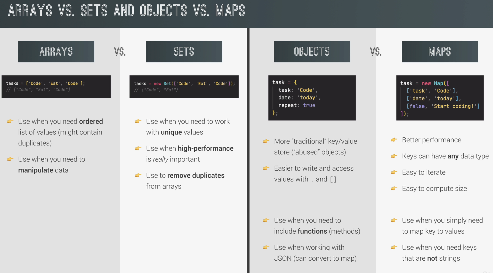

# Destructing objects

- Getting fields from object `restaurant`

```js
const { name, openingHours, categories } = restaurant;
```

- Renaming fields from object `restaurant`

```js
const {
    name: restaurantName,
    openingHours: hours,
}
```

- Setting default values

```js
const { menu = [], starterMenu: starters = [] } = restaurant;
```

- Cannot start something with `{}`

```js
{a,b }= obj; // cannot
({a,b} = obj;) // can
```

- Destructing immediately in the function arguments

```js
const restaurant = {
  // field names need to be the same as object passed in, but no need same order
  orderDelivery: function ({ starterIndex, mainIndex, time, address }) {
    console.log(`Order received! ${this.starterMenu[starterIndex]}...`);
  },
};

restaurant.orderDelivery({
  // here we just pass 1 object
  time: '22:30',
  address: 'sdfsd',
  mainIndex: 2,
  starterIndex: 2,
});
```

# Spread operator (`...`)

- Since ES6
- For cases where we add to elements separated by `,`
  - When pass into new function / new array

```js
const arr = [7, 8, 9];
const badNewArr = [1, 2, arr[0], arr[1], arr[2]];
const newArr = [1, 2, ...arr];
```

- Need individual elements from array

```js
console.log(...arr);
```

- Shallow copy

```js
const mainMenuCopy = [...restaurant.mainMenu];
```

- Spread operator can be used on iterables
  - Iterables: `arrays, strings, maps, sets`
  - NOT objects

# Rest patterns and parameters

## Destructuring

- Rest pattern: left side of `=`
  - Collects elements that are unused in destructing
  - Must be the last element
  - Must have only 1 in destructing

```js
const [a, b, ...others] = [1, 2, 3, 4, 5]; // others is another array
```

## Functions

```js
// pack the numbers back to array (opposite of spread operator) using rest pattern
const add = function (...numbers) {
  let sum = 0;
  for (let i = 0; i < numbers.length; i++) sum += numbers[i];
};

// we want to be able to pass arbitrary number of parameters
add(2, 3);
add(3, 4, 5, 6);
```

# Shortcircuiting with `&&`

```js
var owner;
var d;
d = owner && 'helo'; // d = undefined because short circuit at owner being null
```

# Nullish (`??`)

- `Nulllish`: `null` and `undefined` (NOT `0` or `''`)

```js
var num = 0;
num ??= 10; // num = 10

var un;
un ??= 10; // un = 10
```

# `for of`

```js
for (const item of menu) console.log(item);

for (const [i, el] of menu.entries()) console.log(i, el); // can also do destructing inside
```

# Optional chaining

```js
console.log(restaurant.openingHours.mon?.open);
console.log(restaurant.openingHours?.mon?.open);

// we usually also use the optional chaining with the nullish operator
console.log(users[0]?.name ?? 'User array is empty');
```

# Looping objects

## Looping object keys

- Property names: `Object.keys(<object>)`

## Looping object values

- `Object.values(<object>)`

## Looping entire object

```java
const entries = Object.entries(<object>);
console.log(values);

// destructuring of properties (open, close)
for (const [key, {open, close}] of entries){
  console.log(`On ${key} we open at ${open} and close at ${close}`);
}
```

- Note that:
  - When getting entries of arrays, use: `game.scored.entries()` where `game.scored` is an array, which this will give index & the value
  - When getting entries of objects, use: `Object.entries(game.odds)`

# Sets

- Just like arrays, sets are iterable

```js
const orderSet = new Set(['Pasta', 'Pizza', 'Pasta']);
orderSet.add('Garlic');
orderSet.delete('Risotto');
orderSet.has('Pizza');

// Does not work, there's no way to get specific item from a set, but can iterate
orderSets[0];
```

- Does not quite make sense to retrieve specific element from set, there's not much use case for it, we usually just need to check if an element exists
  - Should use array if needed specific element retrieval

# Maps

```js
const rest = new Map();
rest.set('name', 'Classico');

rest.get(1);
rest.get('name');

// convert map to array
console.log([...rest]);
```

# Strings

```js
const plane = 'A321AB';
console.log(plane[0]);

console.log(plane.indexOf('A')); // will return first appearance
console.log(plane.lastIndexOf('A'));

console.log(plane.slice(2));
console.log(plane.slice(2, 4)); // indexes of 2 & 3
```

## Useful functions

```js
const passenger = 'joNas';
passenger.toLowerCase().trim();

passenger.replace('door', 'gate'); // replace one. In ES21, will have replaceAll()

passenger.includes('A');
passenger.startsWith('A');
```

# Conclusion


