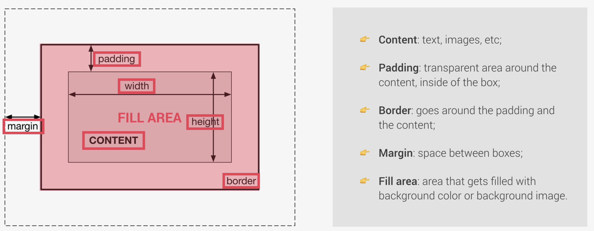

# Summarised learnings from 10/12/2023

## String templates

```js
let name = 'jonas';
console.log(`my name is ${name}`);
```

## Declarations

- `var`: old way for declaring variable
  - There's still difference between `var` and `let`

## Type casting

- `coercion` vs `conversion`
  - `coercion`: Implicit casting
    - Selected operators between strings
      - e.g.: `'5' + 5 = '55'` while `'5' - 5 = 0`
  - `conversion`: Explicit casting
    - e.g.: `String(5) = '5'`

## Falsy and Truthys

- 5 falsy values: values that will be converted to false if `boolean`
  - 0, '', undefined, null, NaN
- Everything else, will be considered aaasa Truthy value
  - e.g.: `Boolean({}) = true`

## Equality operators: `==` vs `===`

- `==`, `!=`: loose, allows type coercion
  - e.g.: `'18' == 18 // true`
  - **BEST PRACTICE:** Can be hard to debug because of implicit conversion, so by default should explicitly convert then use `===`
- `===`, `!==`: strict

## Array operators

- `.indexOf()`
- `.includes()`
- `.pop()`: remove last element
- `'.shift()`: remove first element
- `.push()`: add to the end of the array
- `.unshift()`: add to the start of the array

## Objects

- `dot` vs `bracket` (computed member access) notation
  - `jonas.lastName` or `jonas['lastName']`?
  - Use `dot` if no need dynamic key
- Can store everything, including `function expression`
  ```js
  const jonas = {
    birthYear: 1991,
    calcAge: function () {
      return 2037 - this.birthYear;
    },
  };
  ```
  - `console.log(jonas.calcAge())`
  - `this` here refers to the object calling the function, in this case is `jonas` hence we want `this.birthYear` to get the `birthYear` value
    - Q: Do we really need `this`?
      - Alternatively, we can use `jonas.birthYear` in the function, but if we change the `jonas` name, we need to update as well, hence `this` is more maintainable
- Can use `this.<fieldName>` to create a new field in the object as well

## Useful development environment tools

### Code formatter

- Format on save
- Configuration file

### Code snippets

- `xxx.code-snippets` ("Global User Snippet Files")
  - Declare shortcuts (e.g.: `cl > console.log()`)

### Extensions

- TODO Highlight
- Image Preview

### Live Server

- One way to prevent the need to reload browser during development
- Options:
  - `Live Server` extension
  - [Better] node.js & `liveServer` npm library

## Debug

- Can use browser > "Source" to debug
- Can also include `debugger;` in js codebase to open up debugger tool in browser

CONTINUE FROM https://learncsc.udemy.com/course/the-complete-javascript-course/learn/lecture/22648397#overview

# The CSS Box Model


