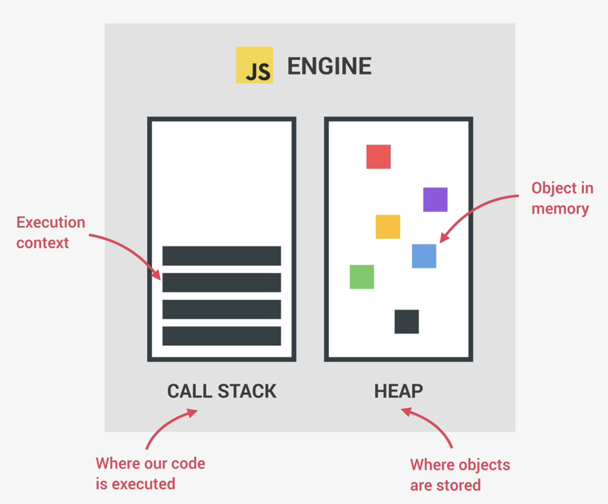
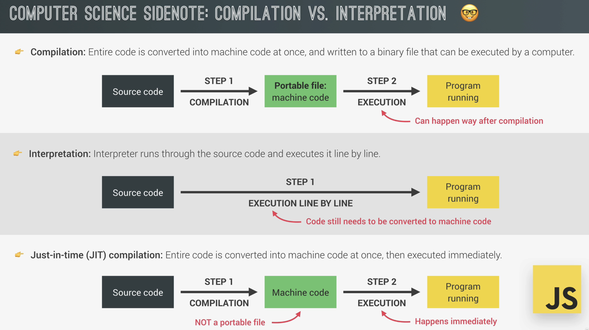
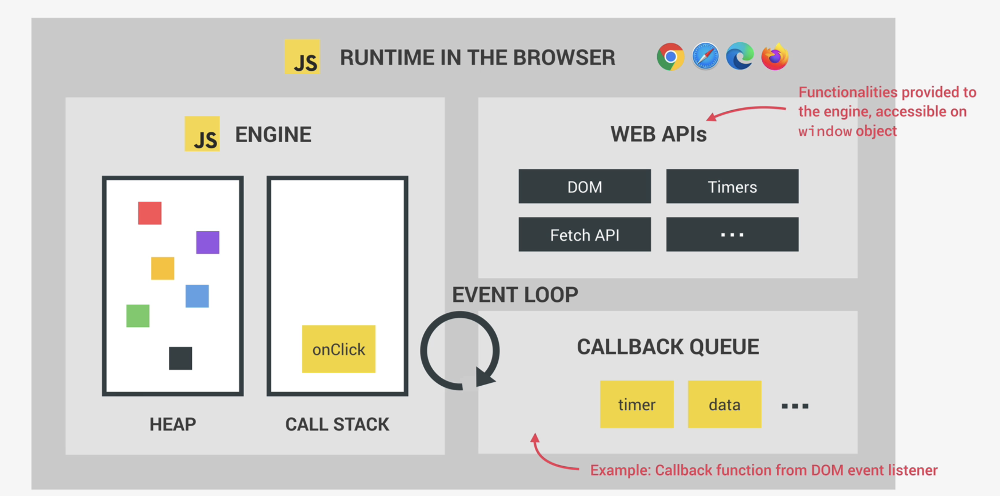
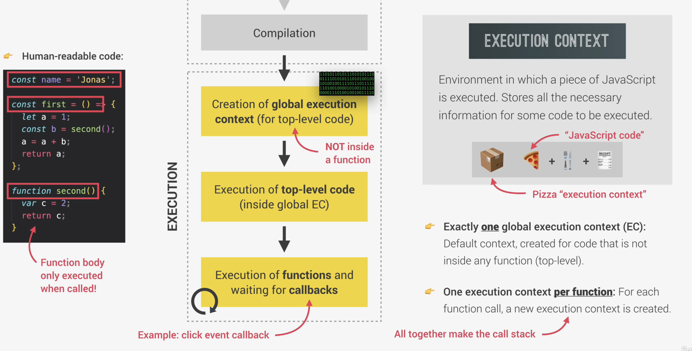
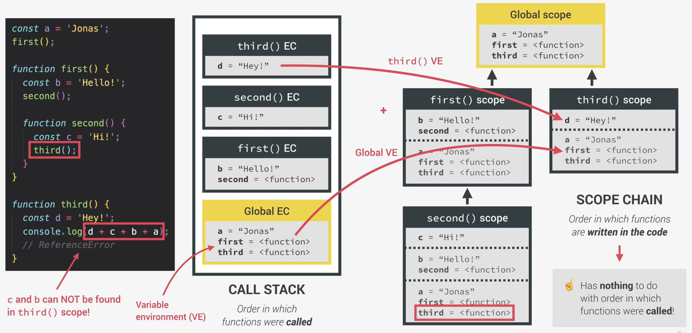
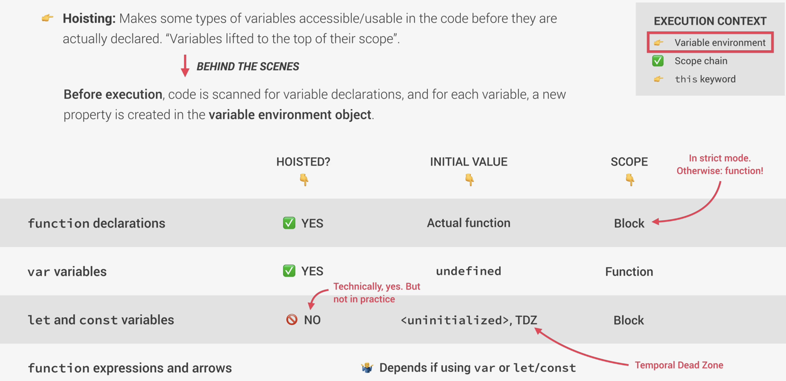
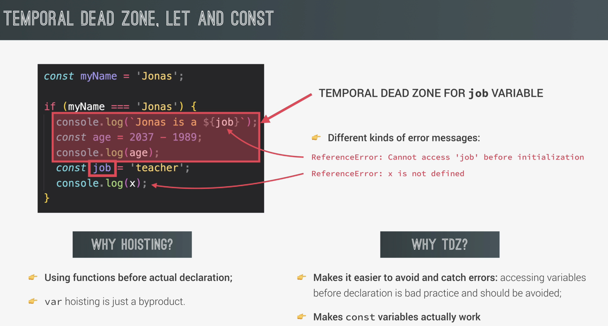
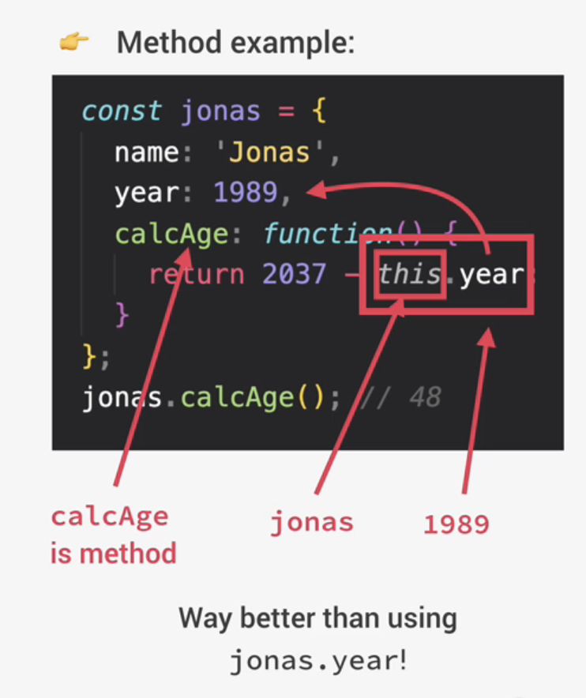
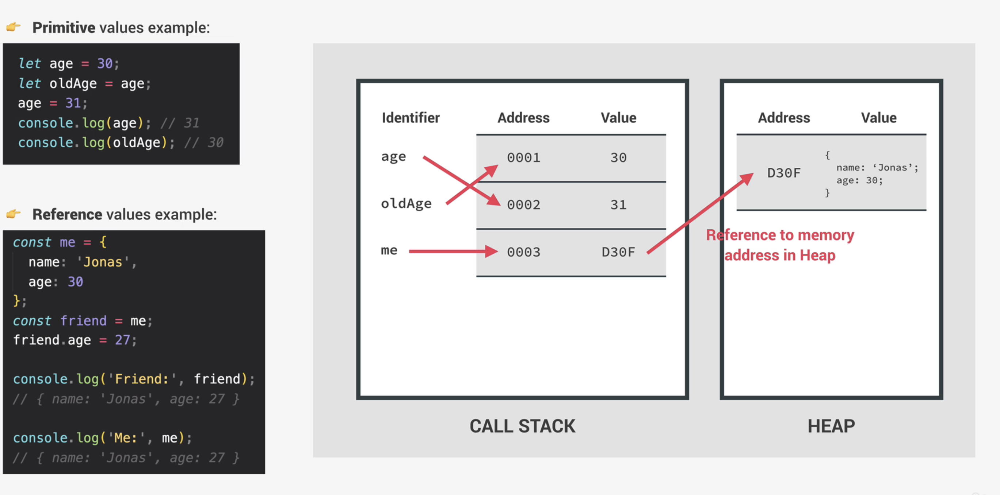

# What

- Javascript is a:
  - High-level
  - Prototype-based object-oriented
  - Multi-paradigm
  - Interpreted or just-in-time compiled
  - Dynamic
  - Single-threaded
  - Garbage-collected programming language with
  - First-class functions and a
  - Non-blocking event loop concurrency model

## Intepreted or JIT compiled

- We write readable code, then have to be converted to machine language (`0 or 1s`)

## Multi-paradigm

- Paradigm: an approach and mindset of structuring code, which directs our coding style and technique
  - Imperative vs Declarative
- Different paradigms:
  - Procedural programming
  - Object-oriented programming
  - Functional programming
- Many langugages only have either 1 paradigm, but JS supports 3

## First-class functions

- Functions are simply treated as variables
  - Can pass them into other functions and return them from functions

## Dynamic

- Dynamically-typed language
  - No data type definitions
  - Types become known at runtime
- Data type of variable is automatically changed when we set to another value type

## Single-threaded, Non-blocking

- JS runs in 1 single thread, can only do 1 thing at a time
- Hence we have concurrency model
- So what about a long-running task?
  - This would block the single thread. However, we want a non-blocking behaviour
- How can we achieve non-blocking behaviour?
  - Use an event loop: takes long running tasks, executes them in the background & puts them back in the main thread once they are finished

# JS Engine

- Program that executes javascript code
- Example: V8 Engine - powers chrome
  

## JIT Compilation



- Very fast
  - No executable code, straight away execute after comilation

# JS runtime

- JS runtime in the browser
  - Runtime is the container including all the things that we need to use JS (in this case in the browser)
    
- What happens:
  1. Event is called (e.g.: `onClick`)
  2. Callback function will be put inside the queue
  3. When Call Stack in JS Engine is empty, callback function passed to the stack, using `Event Loop`
     - `Event Loop` is important for concurrency

## Execution context

- Execution context: Environment in which a piece of JS is executed
- After compilation > Creation of global-execution context (for top-level code; not inside a function)
  
- Exactly 1 global execution context (EC):
  - Default context, created for code that is not inside any functions
- 1 execution context per function
  - For each function call, a new execution context is created

### What's inside the execution context?

1. Variable environment

   - `let, const, var` declarations
   - Functions
   - `arguments` object (only exist in regular functions, not arrow functions)

   ```js
   const addExpr = function (a, b) {
     console.log(arguments); // will be an argument object
     return a + b;
   };

   addExpr(2, 5); // usual way, where only pass in the number of arguments defined
   addExpr(2, 5, 6); // allowed, just that not defined for the 3rd argument
   ```

2. Scope chain
3. `this` keyword
   - Generated during `creation phase`, right before execution

- NOTE: Arrow functions does not have `arguments` object or `this` keyword
  - Can get from regular parents

# Scoping and Scope in JS

- Lexical scoping: scoping is controlled by placement of functions and blocks in the code
  - e.g.: If a block scope and another inner function is created inside a function, they are sibling scope (i.e. "same level") and will not be able to access one another's variables
- Scope: space or environment in which a certain variable is **declared** (variable environment in case of functions)
  - There is global scope, function scope, and block scope
- Scope of a variable: region of our code where a certain variable can be **accessed**
- Scope has access to variables from all outer scopes (parent scope)
  - "Variable lookup in scope chain"
- It doesn't matter if a variable is declared after a function is declared where the function uses this global variable
  - AS LONG AS, the function call is after the variable is declared
- JS will always lookup variable in the current scope first, hence, if there is variable of a same name declared in the global and function scope,
  - JS will use the function scope

## 3 types of scope

### Global scope

- Outside of any function or block
- Variables declared in global scope can be accessible everywhere

### Function scope

- Accessible only inside functions
- Also called local scope

### Block scope (ES6)

- Accessible only inside block (block scoped)
  - `{}` (e.g.: `IF`)
- However, only applies to `let` and `const` variables
  - i.e. `var` is not just scoped to the block - they are function scope
- Functions are also blcok scoped (only in strict mode, but this is the mode we should be using)

## Scope chain vs Call Stack



### Call stack

- Order in which functions were called

### Scope chain

- Order in which functions are **written in the code**
- Nothing to do with execution context or call stack

# Hoisting

- Hoisting: makes some types of variables accessible/usable in the code before they are actually declared

  - "Variables lifted to the top of their scope"

- Just avoid using `var` which does hoisting and sets variable to `undefined`
- Should also declare variables at the top
- NOTE: Variables declared as `var` will create inside the global window object
  - Can see from:
  ```js
  var x = 1;
  console.log(x === window.x); // this will be true
  ```

## Behind the scenes



## Temporarl dead zone (TDZ), `let` and `const`



# `this` keyword

- `this`: special variable that is created for every execution context (every function)
  - takes the value (points to) the "owner" of the function in which the `this` keyword is used
- `this` is NOT static
  - It depends on how the function is called, and its value is only assigned when the function is actually called
- `this` in `global scope` is the `window` object
  - i.e. `console.log(this);`

## Different ways to call a function

### 1. Method call - `this` = <Object that is calling the method>

- Example:
  

### 2. Simple function call (not attached to any objects) - `this = undefined`

- Only works in strict mode, otherwise: `this` will point to the `window (in the browser)`

```js
const calcAge = function (birthYear) {
  console.log(this); // will be undefined in strict mode
};
calcAge(1991);
```

- Same even if the simple function call is actually within a method

```js
const jonas = {
    firstName = 'Jonas',
    year: 1991,
    // Regular method function
    calcAge: function(){
        console.log(this); // this = jonas object
        console.log(2037 - this.year);

        // 1. Regular function
        const isMillenial = function() {
            console.log(this); // will be undefined because it is still considered a simple function call even though it is within this calcAge
        }
        // 2. BUT if we change to arrow function
        const isMillenialArrow = () => {
            console.log(this); // this will follow parent's scope, which is calcAge's this -> thus is jonas object
        }

        isMillenial(); // simple function call
        isMillenialArrow();
    },
}
jonas.calcAge();
```

### 3. Arrow function - `this` = <this of surrounding (parent) function (lexical this)>

- Lexical `this`: gets pick up from the outer lexical scope of arrow function

```js
const calcAgeArrow = birthYear => {
  console.log(this); // will follow the lexical `this`, which in this case is the global scope `this`, and thus is `window`
};
calcAgeArrow(1990);
```

- Should not use arrow function as a method!

### 4. Event listener - `this` = <DOM element that the handler is attached to>

### 5. Others: `new, call, apply, bind...`

## Common misconceptions

- `this` does NOT point to the function itself, and also NOT its variable environment

## Regular functions vs Arrow functions

```js
// Because of var, this firstName will be in global scope -> window object
var firstName = 'Matilda';

// NOTE: This is not code block, but is just how we declare the object
const jonas = {
    firstName = 'Jonas',
    year: 1991,
    // Regular function
    calcAge: function(){
        console.log(this);
        console.log(2037 - this.year);
    },
    // Arrow function
    greet: () => {
        console.log(this); // Arrow function will follow lexical scope, which is global scope in this case, so this is the `window`
        console.log(`Hey ${this.firstName}`); // hence this is window.firstName, which because of the var variable, we will have "Hey Matilda"
    }
}

jonas.greet();
```

- Should not use arrow function as a method!

# Primitives, Objects and JS Engine

## Primitives

- `Number`, `String`, `Boolean`, `Undefined`, `Null`, `Symbol`, `BigInt`
- Stored in call stack
- A variable actually hold a memory address
  - e.g.
  ```js
  let age = 30; // age points to a memory address with value = 30
  let oldAge = age; // oldAge points to the same memory address
  ```

## Objects

- `Object literal`, `Arrays`, `Functions`
- Objects are considered reference values where

  - They point to a memory address in the Heap where the actual object value is stored
  - Because the object may be very big where call stack may not have space

  

- If we really want to make a shallow copy, i.e. a new reference, we can do this:

  ```js
  const jessica = {...} // an object
  const jessicaCopy = Object.assign({}, jessica)
  jessica.lastName = 'Davis'; // this will thus only change jessica's and not jessicaCopy's
  ```

  - However, note this is only shallow copy, where `Object.assign(..)` only work for the first-level. If there is an embedded object inside, then will still be referencing the same one in the heap
    - Usually we use external library to do deep clone (`lodash`)

- Side note: we can still change values of `const objectMe = {..}`
  - Because object is just pointing to a reference in heap, where this address still did not change (i.e. still `const`), but allows changes of values
    - Only `const` for primitives not allowed to change
